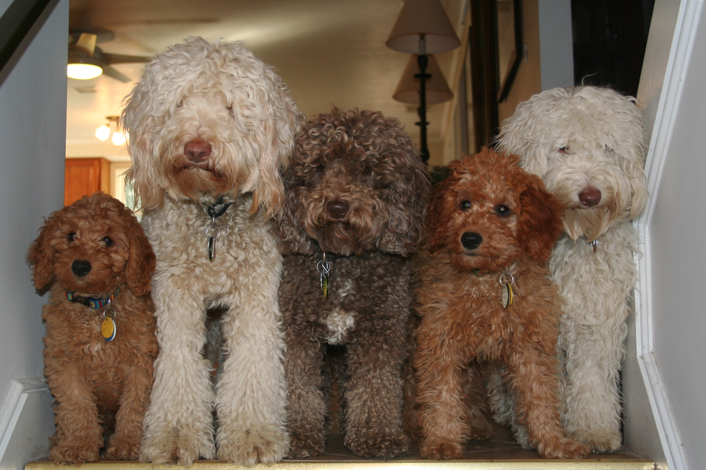

# Labradoodle

> A pack of impressively well-behaved doodles, via [Ocean State Labradoodles](http://www.oceanstatelabradoodles.com/)

## Motivation
This repo hopes to be a collection of clean environments useful in testing various tools both in isolation and concert with each other.

## Environments
Here are the currently available environments:
- Webpack
- Webpack w/ Babel
- Webpack w/ React (via Babel, includes JSX)

## Getting Started
There may be differences in setup between environments (once there is more than one environment) so these instructions are a bit generic.

```sh
$ git clone https://github.com/AllenSH12/labradoodle.git
Cloning into labradoodle...

$ cd labradoodle

$ cd $ENVIRONMENT_TO_TEST # i.e. webpack
$ $INSTALL_ENVIROMENT_DEPENDENCIES # i.e. npm install
$ $RUN_ENVIRONMENT_PREVIEW # i.e. npm start

```

## Roadmap

Environments to add:
- Webpack w/ JSX and CSSModules
